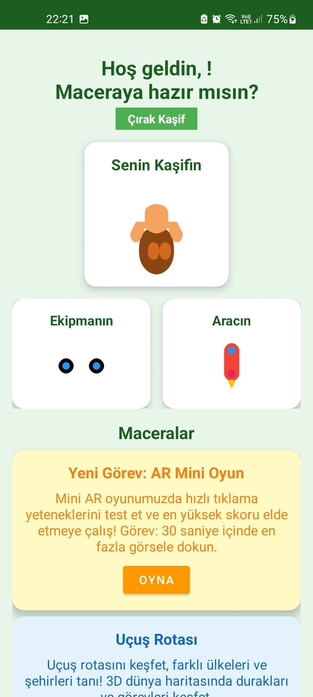
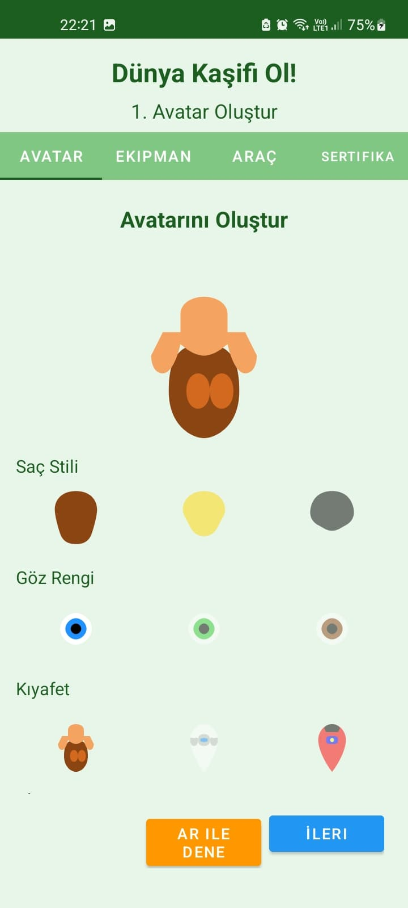
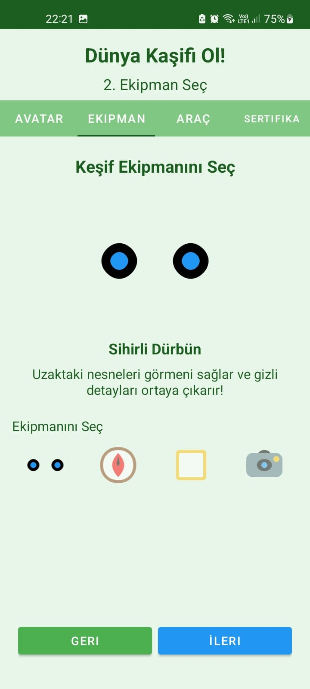
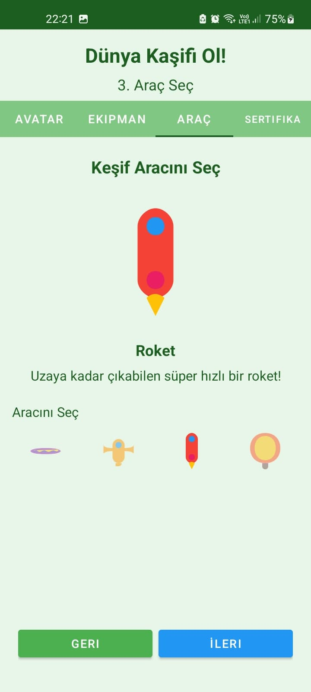
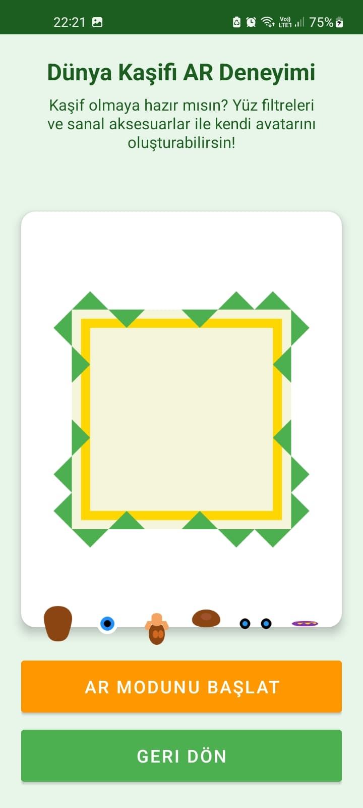
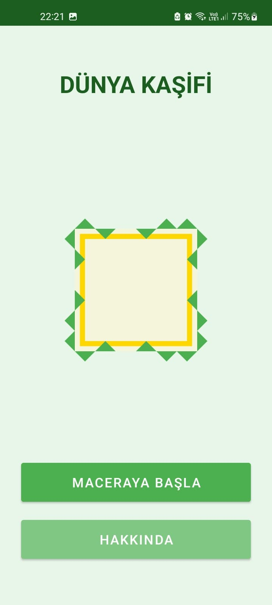
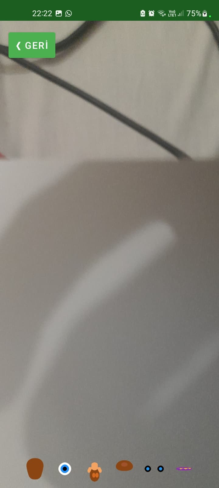

# 🌍 Dünya Kaşifi AR Deneyimi
*Artırılmış Gerçeklik Temelli Mobil Uygulama*



## 📱 Proje Açıklaması

**Dünya Kaşifi**, çocukların eğlenceli ve interaktif bir AR (Artırılmış Gerçeklik) deneyimi yaşamalarını sağlamak amacıyla tasarlanmış modern bir Android uygulamasıdır. Uygulama, çocukların kişiselleştirilmiş avatarları ile sanal dünyada keşif yapmasını sağlar.

## 🌟 Özellikler

### 🎨 Karakter Oluşturma Sistemi
- **Avatar Tasarımı:** Saç stili, göz rengi, kıyafet ve aksesuar seçimi
- **Keşif Ekipmanları:** Dürbün, pusula, not defteri, fotoğraf makinesi
- **Ulaşım Araçları:** Sihirli halı, uçak, roket, sıcak hava balonu




### 📱 AR Modu Özellikleri
- **CameraX Entegrasyonu:** Profesyonel kamera preview sistemi
- **Real-time Overlay:** Kamera üzerine gerçek zamanlı karakter özellikleri
- **Interactive Controls:** Butonlarla anlık karakter değişiklikleri
- **Tam Ekran Deneyim:** Immersive AR deneyimi




### 🎮 Mini Oyunlar
- **Tıklama Oyunu:** Zamana karşı puan toplama
- **Interaktif Görseller:** Rastgele değişen hedefler
- **Skor Sistemi:** Performans tabanlı puanlama
- **Ses Efektleri:** Immersive audio deneyimi




### 🏆 Sertifika Sistemi
- **Başarı Sertifikaları:** Tamamlanan aktiviteler için ödüller
- **Animasyonlu Geçişler:** Profesyonel kullanıcı deneyimi
- **Kişiselleştirilmiş İçerik:** Kullanıcıya özel sertifikalar


## 🛠️ Teknik Özellikler

### 📋 Sistem Gereksinimleri
- **Android:** 8.0 (API level 26) ve üzeri
- **RAM:** Minimum 3GB
- **Depolama:** 100MB boş alan
- **Kamera:** Ön kamera gerekli
- **Sensörler:** Gyroscope (AR için önerilir)

### ⚙️ Kullanılan Teknolojiler

#### Core Technologies
- **Language:** Kotlin
- **Platform:** Android Native
- **Build System:** Gradle with Kotlin DSL
- **Architecture:** MVVM Pattern

#### AR & Camera
- **Camera Framework:** CameraX
- **AR Implementation:** Custom Overlay System
- **Face Tracking:** Ready for ARCore integration
- **Image Processing:** Real-time camera preview

#### UI/UX
- **UI Framework:** Android Views & Layouts
- **Material Design:** Modern Android UI patterns
- **Animations:** Built-in Android transitions
- **Responsive Design:** Multi-screen support

#### Audio & Multimedia
- **Audio:** MediaPlayer for sound effects
- **Graphics:** Canvas API for custom drawings
- **Image Loading:** BitmapFactory with optimization
- **Memory Management:** Efficient bitmap recycling

## 🚀 Kurulum ve Çalıştırma

### 📥 APK İndirme (Release)
```
🔗 APK Download Link: https://github.com/Burakduran1/Guncel_Konular/raw/main/apk/app-debug.apk
```

### 👨‍💻 Geliştirici Kurulumu

1. **Repository'yi klonlayın:**
```bash
git clone https://github.com/Burakduran1/Guncel_Konular.git
cd Guncel_Konular
```

2. **Android Studio'da açın:**
- Android Studio'yu başlatın
- "Open an existing project" seçin
- Klonlanan dizini seçin

3. **Gradle Sync yapın:**
```bash
./gradlew build
```

4. **Uygulamayı çalıştırın:**
- Android cihaz bağlayın veya emulator başlatın
- Run butonuna basın

### 🔧 Build Instructions

```bash
# Debug build
./gradlew assembleDebug

# Release build  
./gradlew assembleRelease

# Install to device
./gradlew installDebug
```

## 📖 Kullanım Kılavuzu

### 1️⃣ Hoş Geldin Ekranı
Uygulamayı ilk açtığınızda hoş geldin ekranı sizi karşılar. "Başla" butonuna basarak karakter oluşturma ekranına geçin.

### 2️⃣ Karakter Oluşturma
- **Avatar sekmesi:** Saç, göz, kıyafet seçin
- **Ekipman sekmesi:** Keşif araçlarınızı belirleyin  
- **Araç sekmesi:** Ulaşım aracınızı seçin
- **Sertifika sekmesi:** İlerleme durumunuzu görün

### 3️⃣ AR Deneyimi
"AR Modunu Başlat" butonuna basarak:
- Kamera izni verin
- Tam ekran AR deneyimini yaşayın
- Alt butonlarla karakter özelliklerini değiştirin
- Sol üstteki geri butonuyla çıkın

### 4️⃣ Mini Oyunlar
"Oyunu Başlat" ile:
- 30 saniye süreyle hedeflere tıklayın
- Skorunuzu artırın
- Başarı sertifikası kazanın

## 🎯 Proje Mimarisi

### 📁 Dizin Yapısı
```
app/
├── src/main/
│   ├── java/com/example/arkidsgame/
│   │   ├── MainActivity.kt              # Ana aktivite
│   │   ├── WelcomeActivity.kt           # Hoş geldin ekranı
│   │   ├── CharacterCreationActivity.kt # Karakter oluşturma
│   │   ├── ARActivity.kt                # AR deneyimi
│   │   ├── CertificateActivity.kt       # Sertifika sistemi
│   │   ├── OverlayView.kt               # AR overlay çizimi
│   │   └── fragments/                   # Fragment'lar
│   │       ├── AvatarFragment.kt        # Avatar seçimi
│   │       ├── EquipmentFragment.kt     # Ekipman seçimi
│   │       ├── VehicleFragment.kt       # Araç seçimi
│   │       └── CertificateFragment.kt   # Sertifika görüntüleme
│   ├── res/
│   │   ├── layout/                      # XML layout dosyaları
│   │   ├── drawable/                    # Grafik kaynakları
│   │   ├── values/                      # String, color, style
│   │   └── raw/                         # Ses dosyaları
│   └── assets/
│       └── models/                      # 3D model dosyaları
```

### 🏗️ Architecture Components

#### Activities
- **MainActivity:** Uygulama giriş noktası ve navigasyon hub'ı
- **WelcomeActivity:** Kullanıcı onboarding ve giriş deneyimi  
- **CharacterCreationActivity:** ViewPager2 tabanlı karakter özelleştirme
- **ARActivity:** CameraX entegrasyonu ve AR overlay sistemi
- **CertificateActivity:** Başarı sertifikaları ve animasyonlar

#### Custom Views
- **OverlayView:** Canvas tabanlı AR çizim sistemi
- Real-time bitmap rendering
- Memory-efficient graphics processing
- Multi-layer character feature composition

#### Data Management
- SharedPreferences for user settings
- Intent-based activity communication  
- Resource management for graphics and audio
- Lifecycle-aware component handling

## 🔄 Development Workflow

### 🧪 Testing
```bash
# Unit tests
./gradlew test

# UI tests  
./gradlew connectedAndroidTest

# Lint checks
./gradlew lint
```

### 📊 Performance Monitoring
- Memory usage optimization
- Camera resource management
- Bitmap recycling strategies
- Battery usage considerations

### 🐛 Debugging
- Comprehensive logging system
- Error handling for camera permissions
- Graceful degradation for unsupported devices
- User-friendly error messages

## 📱 Demo & Videolar

### 🎬 Tanıtım Videosu
```
🔗 Demo Video: https://github.com/Burakduran1/Guncel_Konular/raw/main/images/Recording%202025-06-17%20223952.mp4
```

### 📸 Uygulama Ekran Görüntüleri
Yukarıdaki görsellerde uygulamanın tüm özelliklerini görebilirsiniz:
- Karakter oluşturma süreci
- AR deneyimi ve real-time kontroller  
- Mini oyun mekaniği
- Sertifika sistemi

## 🚧 Roadmap & Gelecek Özellikler

### v2.0 Planları
- [ ] **ARCore Entegrasyonu:** Profesyonel yüz izleme
- [ ] **3D Model Desteği:** GLB/GLTF model yükleme
- [ ] **Multiplayer Modu:** Arkadaşlarla AR deneyimi
- [ ] **Cloud Storage:** Karakter verilerinin bulut senkronizasyonu
- [ ] **AI Destekli Özellikler:** Akıllı karakter önerileri

### v2.1 Planları  
- [ ] **Geolocation AR:** Konum tabanlı içerikler
- [ ] **Social Features:** Sosyal medya paylaşımı
- [ ] **Advanced Analytics:** Kullanıcı davranış analizi
- [ ] **Internationalization:** Çoklu dil desteği

## 🤝 Katkıda Bulunma

### 🔀 Pull Request Süreci
1. Fork yapın
2. Feature branch oluşturun (`git checkout -b feature/yeniOzellik`)
3. Değişiklikleri commit edin (`git commit -am 'Yeni özellik eklendi'`)
4. Branch'i push edin (`git push origin feature/yeniOzellik`)
5. Pull Request açın

### 🐞 Bug Report
Issues sekmesinden bug raporu açabilirsiniz. Lütfen şunları ekleyin:
- Android versiyonu
- Cihaz modeli
- Hata adımları
- Ekran görüntüsü (varsa)

## 📄 Lisans

Bu proje **MIT Lisansı** altında lisanslanmıştır. Detaylar için [LICENSE](LICENSE) dosyasına bakın.

## 👨‍💻 Geliştiriciler

**Burak Can Duran**
- GitHub: [@Burakduran1](https://github.com/Burakduran1)


**Ahmet Çorak**
- GitHub: [https://github.com/CorakAhmet]


---

*⭐ Projeyi beğendiyseniz yıldız vermeyi unutmayın!*

**Made with ❤️ for kids who love to explore! 🌍** 
